<div align="center">



<br/>

<a href="https://mohamedkaif.netlify.app/">
  
</a>
<a href="mailto:mohamedkaif.sa@gmail.com">
  
</a>

<br/><br/>

**CSE @ LICET · Chennai · 2024—2028**

</div>

---

### `> whoami`

I’m **Mohamed Kaif S A** — a computer science student who likes building systems where software has to **make a decision, prove something, detect something, or adapt**.

I move between **AI, full-stack engineering, security-minded products, blockchain experiments, and weird prototypes**.  
Not because I want the longest tech stack — because I like seeing what happens when different ideas collide.

```txt
CURRENT MODE
├─ ship useful prototypes
├─ learn by breaking + rebuilding
├─ turn hackathon ideas into working systems
└─ make the interface feel as intentional as the code
```

---

### `> selected_builds`

<table>
<tr>
<td width="50%" valign="top">

#### 🔐 [SheProof](https://github.com/mohamed-kaif-1/SheProof)
**Tamper-proof digital evidence verification**

Client-side SHA-256 fingerprinting + Ethereum Sepolia timestamping for proving whether digital evidence has changed — without putting the original file on-chain.

`React` `Vite` `Ethers.js` `Solidity` `Hardhat`

</td>
<td width="50%" valign="top">

#### 🧠 [Hindsight AI](https://github.com/mohamed-kaif-1/HindSigthAI)
**A coding copilot with behavioral memory**

Tracks recurring mistake patterns and uses them to warn about likely coding errors before execution instead of giving the same generic advice every time.

`React` `FastAPI` `Python` `OpenAI` `MongoDB`

</td>
</tr>

<tr>
<td width="50%" valign="top">

#### 🛡️ [AuthForge](https://github.com/mohamed-kaif-1/AuthForge)
**AI-assisted authorization + action control**

Turns natural-language intent into controlled actions with risk classification, approvals, token-vault integration, and audit trails.

`Next.js` `TypeScript` `Supabase` `AI`

</td>
<td width="50%" valign="top">

#### 🌐 [MohamedKaif Portfolio](https://github.com/mohamed-kaif-1/MohamedKaif-Portfolio)
**My interactive corner of the web**

A motion-heavy personal portfolio focused on project storytelling, interaction, and visual identity instead of a conventional résumé page.

[**↗ live**](https://mohamedkaif.vercel.app/)

</td>
</tr>
</table>

---

### `> experiments_in_the_lab`

```yaml
poneglyph:
  mission: detect manipulated / AI-generated media
  angle: multimodal authenticity analysis
  signals: [image, audio]

current_interests:
  - agentic AI + specialized agents
  - multimodal verification
  - secure human-in-the-loop systems
  - blockchain + smart contracts
  - system design
  - experimental web interaction
```

---

### `> stack --only-what-i-use`

<div align="center">


</div>

<br/>

I care more about **why a tool belongs in the architecture** than how many logos I can fit here.

---

### `> signal_log`

| signal | evidence |
|---|---|
| 🥇 **1st Place** | Robo Rumble 3.0 — autonomous line-following robot |
| 🥈 **Runner-Up** | Technical Quiz — CIT Symposium |
| 🥉 **3rd Place** | Technical Quiz — Meenakshi Sundararajan Engineering College |
| 🎙️ **Leadership** | Director — Media, EICON · Class Representative, CSE |
| 🤝 **Community** | NSS volunteering · college events · technical communities |

---

### `> build_philosophy`

```js
const kaif = {
  defaultState: "curious",
  preferredLoop: ["understand", "build", "break", "debug", "ship"],
  likes: ["hard problems", "clean interfaces", "strange ideas", "useful systems"],
  dislikes: ["buzzwords without proof", "projects that stop at the PPT"],
};

while (kaif.defaultState === "curious") {
  buildSomething();
}
```

---

### `> contribution_stream`

<p align="center">
  <picture>
    <source media="(prefers-color-scheme: dark)" srcset="https://raw.githubusercontent.com/mohamed-kaif-1/mohamed-kaif-1/output/github-contribution-grid-snake-dark.svg" />
    <source media="(prefers-color-scheme: light)" srcset="https://raw.githubusercontent.com/mohamed-kaif-1/mohamed-kaif-1/output/github-contribution-grid-snake.svg" />
    
  </picture>
</p>

---

<div align="center">

### `connection.request()`

**Have an unusual problem, ambitious prototype, or hackathon idea?**  
I’m usually interested if it involves building something that hasn’t been reduced to a tutorial yet.

<a href="mailto:mohamedkaif.sa@gmail.com"><b>mohamedkaif.sa@gmail.com</b></a>
&nbsp;·&nbsp;
<a href="https://mohamedkaif.netlify.app/"><b>mohamedkaif.vercel.app</b></a>

<br/><br/>

<sub>build → test → break → learn → rebuild → ship</sub>

</div>
