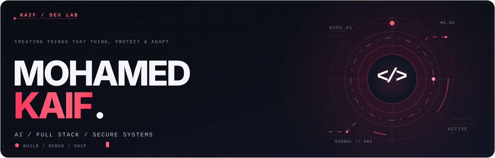

 

&nbsp;

&nbsp;

  

COMPUTER SCIENCE ENGINEERING · LICET · CHENNAI

---

### `01 / about`

I'm **Mohamed Kaif S A**, a Computer Science Engineering student building at the intersection of **Artificial Intelligence, Full-Stack Engineering, and Secure Systems**.

I enjoy creating intelligent applications, solving engineering problems, and designing interactive experiences that bring ambitious ideas to life.

**Currently exploring**

`Agentic AI` · `Multimodal AI` · `Computer Vision` · `Secure Systems` · `Real-Time Applications`

---

### `02 / selected work`

<table>
<tr>
<td width="50%" valign="top">

<h3><a href="https://github.com/mohamed-kaif-1/Poneglyph">Poneglyph ↗</a></h3>

<b>Multimodal Media Authenticity Detection</b>

An AI-driven system exploring detection of manipulated and synthetic images and audio, with authenticity analysis and detection history.

<code>Python</code> <code>FastAPI</code> <code>PostgreSQL</code>

</td>
<td width="50%" valign="top">

<h3><a href="https://github.com/mohamed-kaif-1/Nexus">Nexus ↗</a></h3>

<b>Intelligent Public Safety Orchestration</b>

A real-time response coordination platform that combines sensor data, risk scoring, and department-specific action plans for public safety incidents.

<code>Next.js</code> <code>TypeScript</code> <code>Zustand</code>

</td>
</tr>

<tr>
<td width="50%" valign="top">

<h3><a href="https://github.com/mohamed-kaif-1/SheProof">SheProof ↗</a></h3>

<b>Blockchain Evidence Verification</b>

A tamper-evident digital evidence platform using cryptographic hashing and Ethereum timestamping to verify file integrity without uploading original evidence.

<code>React</code> <code>Solidity</code> <code>Ethers.js</code>

</td>
<td width="50%" valign="top">

<h3><a href="https://github.com/mohamed-kaif-1/AuthForge">AuthForge ↗</a></h3>

<b>AI-Powered Authorization</b>

An authorization and action-control platform exploring natural-language actions, risk classification, approval workflows, and auditable operations.

<code>Next.js</code> <code>TypeScript</code> <code>Supabase</code>

</td>
</tr>

<tr>
<td width="50%" valign="top">

<h3><a href="https://github.com/mohamed-kaif-1/HindSigthAI">Hindsight AI ↗</a></h3>

<b>Predictive Coding Copilot</b>

An intelligent coding assistant designed to identify recurring programming mistakes and provide personalized, context-aware feedback.

<code>React</code> <code>FastAPI</code> <code>Python</code>

</td>
<td width="50%" valign="top">

<h3><a href="https://github.com/mohamed-kaif-1/Code-Garden">Code Garden ↗</a></h3>

<b>Gamified Java Learning</b>

A desktop learning experience combining live Java code execution, interactive challenges, and a virtual garden that evolves through programming progress.

<code>Java</code> <code>JavaFX</code> <code>JShell</code>

</td>
</tr>

<tr>
<td width="50%" valign="top">

<h3><a href="https://github.com/mohamed-kaif-1/CrisisMindAI">CrisisMindAI ↗</a></h3>

<b>AI-Assisted Crisis Response</b>

An experimental application exploring intelligent crisis-response workflows, emergency assistance, and interactive interfaces.

<code>React</code> <code>Vite</code> <code>JavaScript</code>

</td>
<td width="50%" valign="top">

<h3><a href="https://github.com/mohamed-kaif-1/MohamedKaif-Portfolio">Interactive Portfolio ↗</a></h3>

<b>Creative Developer Portfolio</b>

A motion-driven portfolio showcasing projects through interactive experiences, animated transitions, and visual storytelling.

<a href="https://mohamedkaif.vercel.app/">Live Website ↗</a>

  

<code>JavaScript</code> <code>CSS</code> <code>Animation</code>

</td>
</tr>
</table>

---

### `03 / tech stack`

<b>LANGUAGES</b>

  

  

<b>FRONTEND & CREATIVE DEVELOPMENT</b>

  

  

<b>BACKEND & APIS</b>

  

  

<b>DATABASES</b>

  

  

<b>COMPUTER VISION & ROBOTICS</b>

  

 

MediaPipe · ROS 2 · OpenCV

  

<b>DEVELOPMENT & DEPLOYMENT</b>

  

  

<b>OTHER TECHNOLOGIES</b>

  

<code>JavaFX</code>
<code>Hardhat</code>
<code>Ethers.js</code>
<code>Recharts</code>
<code>JShell</code>

---

### `04 / github activity`

<picture>
<source media="(prefers-color-scheme: dark)" srcset="https://raw.githubusercontent.com/mohamed-kaif-1/mohamed-kaif-1/output/github-contribution-grid-snake-dark.svg"/>
<source media="(prefers-color-scheme: light)" srcset="https://raw.githubusercontent.com/mohamed-kaif-1/mohamed-kaif-1/output/github-contribution-grid-snake.svg"/>

</picture>

---

### `connection.request()`

**Have an ambitious idea or something worth building?**

 

<a href="https://mohamedkaif.vercel.app/">Portfolio</a>
&nbsp;·&nbsp;
<a href="https://github.com/mohamed-kaif-1">GitHub</a>
&nbsp;·&nbsp;
<a href="mailto:mohamedkaif.sa@gmail.com">Email</a>

  

BUILD → TEST → DEBUG → REFINE → SHIP

